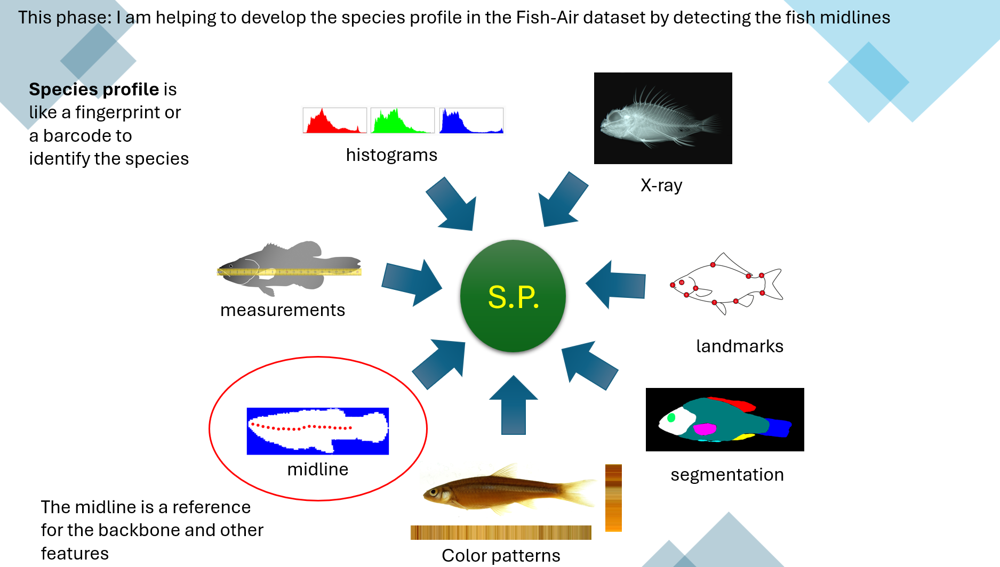
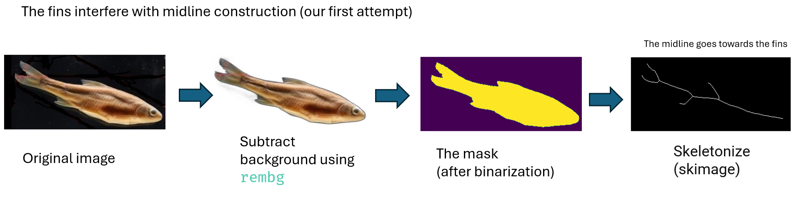
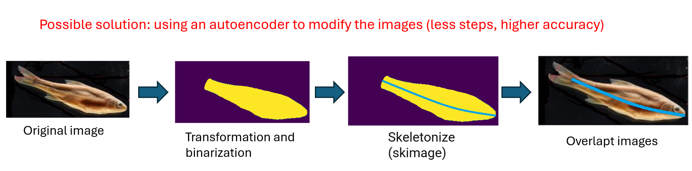
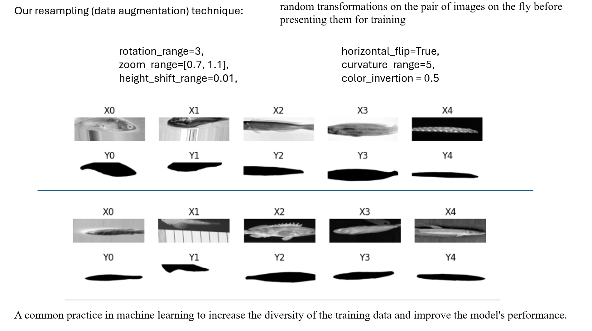
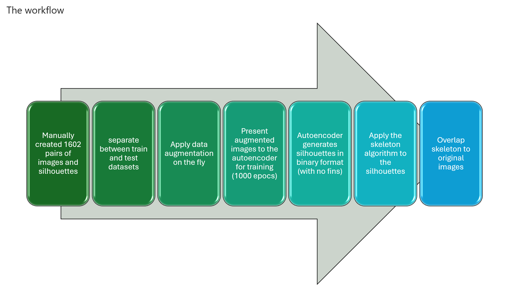
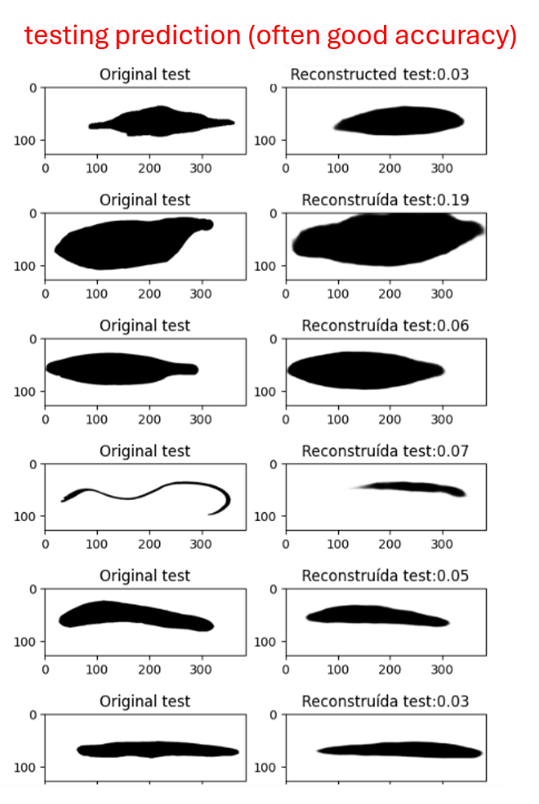

# Efficient Midline Detection for Enhanced Fish Species Profiling in AI Applications

## Authors
- **Marcio Ferreira**
- **Yasin Bakış**
- **Bahadir Altintas**
- **Xiaojun Wang**
- **Dom Jebbia**
- **Henry Bart**

## Developed by
Tulane University Biodiversity Institute

## Acknowledgments
This is my postdoc project entitled *Efficient Midline Detection for Enhanced Fish Species Profiling in AI Applications*. The project is being developed at the Tulane University Biodiversity Institute in New Orleans.

---

## Project Aim
Enhance the quality of the metadata in the Fish Air database, a digitized collection of specimens. FishAIR is a FAIR and AI-Ready dataset with reusability, data provenance, image quality, and many other features.

- [FishAIR](https://fishair.org)
- Coordinators: Users can count on API Access and globally unique identifiers (ARK iD)

---

## Midline Detection
This phase focuses on developing the species profile in the Fish-Air dataset by detecting the fish midlines.

- **Species Profile**: A fingerprint or a barcode to identify the species.
- **Midline**: Reference for the backbone and other features.

**Challenges**:
- Variability in fish shapes, angles, and curvatures
- Complex backgrounds

## Approach
1. **Image Processing**:
   - Subtract background using `rembg`.
   - Binarization and skeletonization using `skimage`.

2. **Autoencoder**:
   - Modify images to remove fins (reducing steps and increasing accuracy).
   - Variational autoencoder (VAE) for data generation and modification.

## Data
- **Training Set**: 1335 images
- **Testing Set**: 267 images
- **Total**: 1602 images
- **Metric**: Median Squared Error (MSE)

## Data Augmentation
- **Techniques**: Rotation, zoom, height shift, horizontal flip, curvature, and color inversion.
- **Purpose**: Increase diversity and improve model performance.

## Workflow
1. Apply data augmentation on the fly.
2. Autoencoder generates silhouettes in binary format (without fins).
3. Apply the skeleton algorithm to the silhouettes.
4. Overlap skeleton with original images.
5. Present augmented images to the autoencoder for training (1000 epochs).
6. Evaluate results using MSE for training and testing data.

---

## Results
- **Training Prediction**: Better accuracy
- **Testing Prediction**: Often good accuracy, with challenges in rare shapes or positions.

## Next Steps
1. Explore the latent space to identify rare shapes and include more examples in the training set.
2. Train longer with more aggressive data augmentation.

---

This project aims to refine the process of detecting fish midlines for enhanced species profiling, leveraging advanced AI techniques and robust data augmentation strategies to overcome inherent challenges in the dataset.
